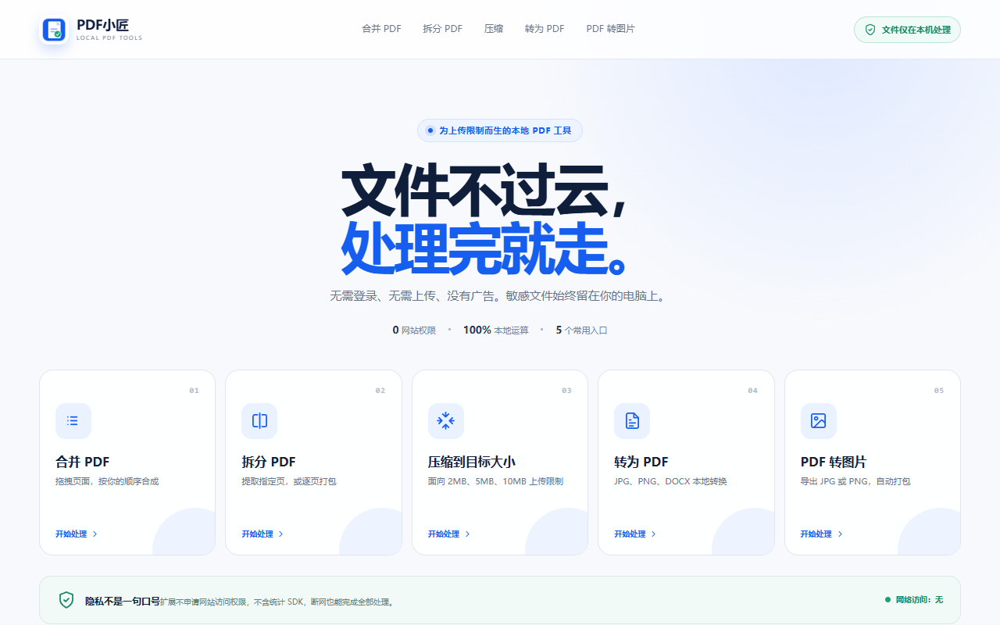

# PDF小匠

> 文件不过云，处理完就走。

PDF小匠是一款适用于 Microsoft Edge 和 Google Chrome 的本地 PDF 浏览器扩展。无需登录，没有广告，文件不会上传到服务器；打开扩展、选择文件、完成处理并下载结果即可。



## 特色

- **本地处理**：文件始终保留在你的设备上
- **简单直接**：只提供日常最常用的 PDF 功能
- **目标压缩**：面向 2 MB、5 MB、10 MB 等上传大小限制
- **无需账户**：不登录、不订阅、没有广告或使用统计
- **双浏览器支持**：同一扩展支持 Edge 和 Chrome

## 功能

- 合并多个 PDF，可继续选择或拖入文件，并通过缩略图调整页面顺序
- 拆分 PDF、提取指定页或逐页导出
- 将 PDF 尽量压缩到指定大小
- 将 JPG、PNG 或 DOCX 转为 PDF
- 将 PDF 页面导出为 JPG 或 PNG

## 使用方法

1. 点击浏览器工具栏中的 **PDF小匠**图标。
2. 选择需要的 PDF 工具。
3. 添加本地文件并按页面提示调整选项。
4. 开始处理并下载生成的文件。

所有处理都在当前浏览器页面中完成。关闭页面后，扩展不会保留已选择的文件。

## 本地安装

商店版本发布前，可以通过开发者模式安装：

```bash
npm ci
npm run build
```

然后打开 `edge://extensions` 或 `chrome://extensions`，开启“开发人员模式”，选择“加载解压缩的扩展”，并加载生成的 `dist` 目录。

## 使用边界

- 不支持旧版 `.doc`，请先另存为 `.docx`
- 不支持设有打开密码的 PDF
- DOCX 的复杂表格、文本框和特殊字体可能与 Microsoft Word 略有差异
- 强压缩可能影响文字搜索、链接、表单和数字签名
- 极端目标大小不一定能在保持可读性的同时达到

## 隐私与许可

PDF小匠不申请网站访问权限，不包含服务器、账户、广告、统计 SDK 或远程执行代码。详情见[隐私政策](PRIVACY.md)和[安全政策](SECURITY.md)。

页面底部的“支持开发”入口完全自愿，只显示扩展包内置的微信支付收款码，不影响或解锁任何功能。

项目采用 [MIT License](LICENSE)，第三方组件许可见 [THIRD_PARTY_NOTICES.md](THIRD_PARTY_NOTICES.md)。

---

**English:** PDF小匠 is a zero-permission, offline PDF toolkit for Edge and Chrome. It merges, splits, reorders, compresses, creates, and exports PDFs without uploading files.
